# Leadirftex Interchain — Master Design Reference

**Platform Name:** Leadirftex Interchain  
**Brand:** Leadirftex  
**Planned Domain:** Leadirftex.com  
**Document Classification:** Master UI/UX & Design System Blueprint  
**Status:** Canonical Reference (Phase 1: Design System & Mockup Only)

---

## 1. Brand & Visual Direction

### 1.1 Brand Identity & Purpose
Leadirftex Interchain is a global B2B digital infrastructure platform connecting international textile, apparel, fabric, machinery, trims, raw material suppliers, certified manufacturers, and global buyers. Unlike consumer retail or casual wholesale marketplaces, Leadirftex functions as an industrial trade operating system. Its visual and UX language balances **institutional enterprise trust**, **cutting-edge supply-chain technology**, and **manufacturing domain rigor**.

### 1.2 Logo & Wordmark Treatment
- **Wordmark Structure:** `LEADIRFTEX` set in heavy geometric sans-serif (tracking `+0.05em`), paired with a technical monospace sub-descriptor: `INTERCHAIN` or `GLOBAL TEXTILE NETWORK`.
- **Glyph Symbol:** The Interchain Hex-Weave — a stylized geometric textile weave overlapping with a node-network loop, symbolizing the intersection of physical spinning/weaving and digital interchain transparency.
- **Clearance & Scale:** Minimum clear space is equal to the height of the "L" glyph on all 4 quadrants. Minimum digital height is `28px` for desktop headers and `22px` for mobile app bars.

### 1.3 Visual Character & Aesthetic Personality
- **Enterprise-Grade Authority:** High-contrast, clean typography, precise grid alignment, clear data density without visual clutter.
- **Manufacturing & Sourcing Rigor:** Clear technical specifications (GSM, yarn count, fabric construction, machine RPM, lead times, MOQs, lab dips, AQL standards).
- **Technological Modernity:** Sleek deep-slate surfaces, electric interchain blue accents, subtle borders, crisp micro-interactions.
- **Marketplace Trust:** Transparent audit indicators, verifiable physical certifications, explicit differentiation between human-verified and machine-predicted data.

---

## 2. Design Foundation

### 2.1 Typography System
The typography hierarchy uses **Plus Jakarta Sans** / **Inter** for UI, headings, and data tables, paired with **JetBrains Mono** for technical specifications, product codes, HS codes, and cryptographic hash verification stamps.

| Token | Family | Weight | Size (px/rem) | Line Height | Letter Spacing | Primary Usage |
| :--- | :--- | :--- | :--- | :--- | :--- | :--- |
| `font-display-xl` | Sans-Serif | 700 (Bold) | `48px / 3.0rem` | `1.15` | `-0.025em` | Hero banners, primary hub landing titles |
| `font-display-lg` | Sans-Serif | 700 (Bold) | `36px / 2.25rem` | `1.2` | `-0.02em` | Hub headline, major dashboard greetings |
| `font-h1` | Sans-Serif | 600 (SemiBold) | `30px / 1.875rem`| `1.25` | `-0.015em` | Page titles, primary workflow view headers |
| `font-h2` | Sans-Serif | 600 (SemiBold) | `24px / 1.5rem` | `1.3` | `-0.01em` | Section headers, modal titles, drawer headers |
| `font-h3` | Sans-Serif | 600 (SemiBold) | `20px / 1.25rem` | `1.35` | `-0.005em` | Card titles, group headings, table titles |
| `font-h4` | Sans-Serif | 600 (SemiBold) | `16px / 1.0rem` | `1.4` | `0em` | Sub-card headers, parameter labels |
| `font-body-lg` | Sans-Serif | 400/500 | `16px / 1.0rem` | `1.5` | `0em` | Lead paragraphs, long-form overview text |
| `font-body-md` | Sans-Serif | 400/500 | `14px / 0.875rem`| `1.5` | `0em` | Default UI body, form fields, table cells |
| `font-body-sm` | Sans-Serif | 400/500 | `12px / 0.75rem` | `1.45` | `+0.01em` | Secondary metadata, timestamps, helper text |
| `font-caption` | Sans-Serif | 500/600 | `11px / 0.6875rem`| `1.4`| `+0.02em` | Small badges, status tags, micro-labels |
| `font-mono-md` | Monospace | 500 | `13px / 0.8125rem`| `1.45` | `0em` | Spec values, GSM, yarn counts, prices |
| `font-mono-sm` | Monospace | 500 | `11px / 0.6875rem`| `1.4` | `0em` | Component IDs, HS codes, PO hashes, IDs |

### 2.2 Color Palette & Semantic System
Every color in the Leadirftex system is bound to a strict semantic function to prevent arbitrary styling.

#### Brand & Foundation Colors
- **Interchain Navy (Deep Slate Primary):**  
  `#0B192C` (Brand-950), `#1E3E62` (Brand-900), `#1E293B` (Brand-800)  
  *Usage:* Global header, high-authority cards, enterprise navigation, high-contrast dark surfaces.
- **Interchain Tech Blue (Accent Primary):**  
  `#2563EB` (Primary-600), `#1D4ED8` (Primary-700), `#3B82F6` (Primary-500), `#EFF6FF` (Primary-50)  
  *Usage:* Primary call-to-actions, active navigation states, interactive links, workflow triggers.
- **Precision Industrial Slate (Neutral Grayscale):**  
  `#0F172A` (Slate-900), `#334155` (Slate-700), `#64748B` (Slate-500), `#94A3B8` (Slate-400), `#CBD5E1` (Slate-300), `#E2E8F0` (Slate-200), `#F1F5F9` (Slate-100), `#F8FAFC` (Slate-50), `#FFFFFF` (White)  
  *Usage:* Surfaces, borders, secondary text, muted metadata, grid dividers.

#### Semantic Status & Trust Colors
- **Physical Verification Emerald:**  
  `#059669` (Emerald-600), `#10B981` (Emerald-500), `#D1FAE5` (Emerald-50), `#064E3B` (Emerald-900)  
  *Usage:* Strictly reserved for verified physical factories, verified audit certificates, approved lab dips, QA pass.
- **AI Assessment & Algorithmic Violet:**  
  `#7C3AED` (Violet-600), `#8B5CF6` (Violet-500), `#EDE9FE` (Violet-50), `#4C1D95` (Violet-900)  
  *Usage:* Strictly reserved for AI matching scores, automated requirement analysis, predicted lead times, synthetic models.
- **Industrial Amber (Materials & Warnings):**  
  `#D97706` (Amber-600), `#F59E0B` (Amber-500), `#FEF3C7` (Amber-50)  
  *Usage:* Raw materials, stocklot alerts, pending review states, sample modification requests.
- **Critical & Error Crimson:**  
  `#DC2626` (Red-600), `#EF4444` (Red-500), `#FEE2E2` (Red-50)  
  *Usage:* Defect rates > AQL limits, rejected samples, compliance breach, critical system alerts.
- **Unverified Factory Self-Reported Neutral:**  
  `#64748B` (Slate-500), `#F1F5F9` (Slate-100), `#475569` (Slate-600)  
  *Usage:* Unverified supplier claims, self-declared capacity, non-audited certificates.

### 2.3 Surface & Border System
- **Base Canvas:** `#F8FAFC` (Off-white, reducing screen glare in factory/office usage).
- **Card Surface:** `#FFFFFF` with `#E2E8F0` hairline border (`1px solid`).
- **Sub-Surface (Nested specs/filters):** `#F1F5F9` with `#CBD5E1` border.
- **Command & Dark Surface:** `#0B192C` with `#1E293B` border for global headers and analytical command bars.

### 2.4 Border Radius Scale
- `radius-none`: `0px` (Dense data tables, technical charts)
- `radius-xs`: `2px` (Micro-tags, mono status badges)
- `radius-sm`: `4px` (Form inputs, table action buttons, tech-spec chips)
- `radius-md`: `8px` (Standard cards, standard buttons, dropdown menus, modals)
- `radius-lg`: `12px` (Hero containers, hub profile cards, workflow step containers)
- `radius-xl`: `16px` (Floating action panels, master hub selector dialogs)
- `radius-full`: `9999px` (Pills, avatar icons, circular verification shields)

### 2.5 Shadow & Elevation System
- `elevation-0`: `none` (Flat embedded panels, nested specs)
- `elevation-1`: `0 1px 3px 0 rgba(15, 23, 42, 0.08), 0 1px 2px -1px rgba(15, 23, 42, 0.04)` (Resting cards)
- `elevation-2`: `0 4px 6px -1px rgba(15, 23, 42, 0.10), 0 2px 4px -2px rgba(15, 23, 42, 0.05)` (Card hover, dropdown menus)
- `elevation-3`: `0 10px 15px -3px rgba(15, 23, 42, 0.10), 0 4px 6px -4px rgba(15, 23, 42, 0.05)` (Modals, sticky inspector drawer)
- `elevation-4`: `0 20px 25px -5px rgba(15, 23, 42, 0.15), 0 8px 10px -6px rgba(15, 23, 42, 0.05)` (Floating command bar, global search overlay)

### 2.6 Spacing & Layout Grid
- **Baseline Unit:** `4px` (Strict 4px/8px modular rhythm)
- `space-1` = `4px`  |  `space-2` = `8px`   |  `space-3` = `12px`  |  `space-4` = `16px`
- `space-5` = `20px` |  `space-6` = `24px`  |  `space-8` = `32px`  |  `space-10` = `40px`
- `space-12` = `48px`|  `space-16` = `64px` |  `space-20` = `80px`
- **Max Container Widths:**
  - Standard Content: `1280px`
  - Wide Enterprise Workspace: `1440px`
  - Full-Bleed Monitoring & Data Tables: `1600px` (with `24px` gutter)
- **Grid Structure:** 12-column responsive grid with `16px` gutters on mobile, `24px` on tablet/desktop.

### 2.7 Responsive Breakpoints
- **Mobile (`sm`):** `375px – 639px` (1-column layout, bottom sheets, stacked specs, compact headers)
- **Tablet (`md`):** `640px – 1023px` (2-column layout, collapsible filters, side drawer)
- **Desktop (`lg`):** `1024px – 1439px` (Full 12-column grid, persistent filter sidebar, standard 3-4 card grid)
- **Wide Enterprise (`xl`):** `1440px+` (Multi-pane order workspace, persistent inspection inspector, side-by-side RFQ compare)

---

## 3. Master Design Tokens

The tokens below are exposed as CSS Custom Properties in `:root`:

```css
:root {
  /* Brand Primary */
  --lt-color-brand-950: #0B192C;
  --lt-color-brand-900: #1E3E62;
  --lt-color-brand-800: #1E293B;

  /* Tech Blue Accent */
  --lt-color-primary-50: #EFF6FF;
  --lt-color-primary-100: #DBEAFE;
  --lt-color-primary-500: #3B82F6;
  --lt-color-primary-600: #2563EB;
  --lt-color-primary-700: #1D4ED8;

  /* Physical Verification Emerald */
  --lt-color-verify-50: #ECFDF5;
  --lt-color-verify-100: #D1FAE5;
  --lt-color-verify-500: #10B981;
  --lt-color-verify-600: #059669;
  --lt-color-verify-900: #064E3B;

  /* AI Assessment Violet */
  --lt-color-ai-50: #F5F3FF;
  --lt-color-ai-100: #EDE9FE;
  --lt-color-ai-500: #8B5CF6;
  --lt-color-ai-600: #7C3AED;
  --lt-color-ai-900: #4C1D95;

  /* Industrial Amber / Raw Materials */
  --lt-color-amber-50: #FFFBEB;
  --lt-color-amber-500: #F59E0B;
  --lt-color-amber-600: #D97706;

  /* Danger / Defect Red */
  --lt-color-danger-50: #FEF2F2;
  --lt-color-danger-500: #EF4444;
  --lt-color-danger-600: #DC2626;

  /* Neutrals & Slate */
  --lt-color-slate-50: #F8FAFC;
  --lt-color-slate-100: #F1F5F9;
  --lt-color-slate-200: #E2E8F0;
  --lt-color-slate-300: #CBD5E1;
  --lt-color-slate-400: #94A3B8;
  --lt-color-slate-500: #64748B;
  --lt-color-slate-600: #475569;
  --lt-color-slate-700: #334155;
  --lt-color-slate-800: #1E293B;
  --lt-color-slate-900: #0F172A;
  --lt-color-white: #FFFFFF;

  /* Typography */
  --lt-font-sans: 'Plus Jakarta Sans', 'Inter', -apple-system, BlinkMacSystemFont, 'Segoe UI', Roboto, sans-serif;
  --lt-font-mono: 'JetBrains Mono', 'SFMono-Regular', Menlo, Monaco, Consolas, monospace;

  /* Font Sizes */
  --lt-font-size-display-xl: 3.0rem;    /* 48px */
  --lt-font-size-display-lg: 2.25rem;   /* 36px */
  --lt-font-size-h1: 1.875rem;          /* 30px */
  --lt-font-size-h2: 1.5rem;            /* 24px */
  --lt-font-size-h3: 1.25rem;           /* 20px */
  --lt-font-size-h4: 1.0rem;            /* 16px */
  --lt-font-size-body: 0.875rem;        /* 14px */
  --lt-font-size-sm: 0.75rem;           /* 12px */
  --lt-font-size-xs: 0.6875rem;         /* 11px */

  /* Spacing Scale */
  --lt-space-1: 4px;
  --lt-space-2: 8px;
  --lt-space-3: 12px;
  --lt-space-4: 16px;
  --lt-space-5: 20px;
  --lt-space-6: 24px;
  --lt-space-8: 32px;
  --lt-space-10: 40px;
  --lt-space-12: 48px;
  --lt-space-16: 64px;

  /* Border Radii */
  --lt-radius-none: 0px;
  --lt-radius-xs: 2px;
  --lt-radius-sm: 4px;
  --lt-radius-md: 8px;
  --lt-radius-lg: 12px;
  --lt-radius-xl: 16px;
  --lt-radius-full: 9999px;

  /* Shadows */
  --lt-shadow-0: none;
  --lt-shadow-1: 0 1px 3px 0 rgba(15, 23, 42, 0.08), 0 1px 2px -1px rgba(15, 23, 42, 0.04);
  --lt-shadow-2: 0 4px 6px -1px rgba(15, 23, 42, 0.10), 0 2px 4px -2px rgba(15, 23, 42, 0.05);
  --lt-shadow-3: 0 10px 15px -3px rgba(15, 23, 42, 0.10), 0 4px 6px -4px rgba(15, 23, 42, 0.05);
  --lt-shadow-4: 0 20px 25px -5px rgba(15, 23, 42, 0.15), 0 8px 10px -6px rgba(15, 23, 42, 0.05);
  --lt-shadow-glow-blue: 0 0 0 3px rgba(37, 99, 235, 0.2);
  --lt-shadow-glow-green: 0 0 0 3px rgba(16, 185, 129, 0.2);
  --lt-shadow-glow-violet: 0 0 0 3px rgba(124, 58, 237, 0.2);

  /* Transitions */
  --lt-transition-fast: 150ms cubic-bezier(0.4, 0, 0.2, 1);
  --lt-transition-normal: 250ms cubic-bezier(0.4, 0, 0.2, 1);
}
```

---

## 4. Global Website UI Shell

### 4.1 Header Architecture
The header is composed of two primary tiers:
1. **Utility & Command Bar (Dark - `#0B192C`):**
   - **Logo & Wordmark:** `LEADIRFTEX INTERCHAIN` with hex-weave symbol.
   - **Global Search Input:** Instant search with keyboard shortcut (`⌘K` / `Ctrl+K`), capable of querying products, mills, factories, tech-packs, RFQs, and jobs.
   - **Hub Selector Dropdown:** Direct category jumps across all 21 hubs.
   - **Quick Actions:** "Post Requirement (RFQ)", "Add Fabric/Stocklot".
   - **Account & Notification Area:** Verifiable user avatar, trust tier badge, RFQ ping indicator, language & currency selector (`USD`, `EUR`, `BDT`, `CNY`, `INR`).

2. **Hub Navigation Strip (Light - `#FFFFFF` with `#E2E8F0` border):**
   - 6 Core Ecosystem Clusters:
     1. *Design & Sourcing* (Fashion, CAD, Yarn, Fabrics)
     2. *Manufacturing Network* (Factories, Machinery, Washing, Trims)
     3. *Trade & RFQ* (Buyer Requirements, AI Match, Stocklot, Retail)
     4. *Order Workspace & QA* (Production, Inspection Center, Logistics)
     5. *Intelligence & Trust* (Rating & Trust, Textile Learning)
     6. *Industry Careers* (Job Feed, External Apply, Free CV Builder)

### 4.2 Breadcrumb System
Always present below the header:  
`Leadirftex Interchain` > `[Hub Cluster]` > `[Hub Name]` > `[Active View / Item ID]`

### 4.3 Standard Page Header Pattern
- Left: Page Title, Category Badge, Last Verified Timestamp.
- Right: Primary Contextual Action Button (e.g., "Request Sample", "Submit RFQ", "Download Inspection Report"), Secondary Actions, Share/Export.

### 4.4 Global Footer Architecture
- Enterprise 5-column sitemap covering:
  - Column 1: Core Sourcing & Marketplaces (Hubs 4, 5, 6, 8, 9, 19, 20)
  - Column 2: Manufacturing & Supply Chain (Hubs 1, 7, 10, 11, 15, 16)
  - Column 3: Workflows, Matching & Quality (Hubs 12, 13, 14, 17, 18, 21)
  - Column 4: Knowledge & Careers (Hub 2, 3, Industry Job Feed, Free CV Builder)
  - Column 5: Trust, Security & Compliance (Physical Verification Protocol, AI Audit Disclaimer, ISO/WRAP/OEKO-TEX Standards)
- Bottom strip: Copyright, Domain `Leadirftex.com`, Server Region, Encryption Hash, Legal Disclaimer.

---

## 5. Trust & Verification Visual Rules

Leadirftex enforces an unambiguous visual hierarchy to ensure that algorithmic predictions are never mistaken for ground-truth physical audits.

```
┌────────────────────────────────────────────────────────────────────────┐
│                        DATA SOURCE TAXONOMY                            │
├───────────────────┬────────────────────────────┬───────────────────────┤
│ BADGE TYPE        │ COLOR & ICON SPEC          │ MEANING / LEGAL STATUS│
├───────────────────┼────────────────────────────┼───────────────────────┤
│ PHYSICALLY        │ Background: #ECFDF5        │ On-site audit verified│
│ VERIFIED          │ Border: #10B981            │ by Leadirftex or      │
│ (VERIFIED DATA)   │ Text: #064E3B              │ accredited inspection │
│                   │ Icon: Shield with Checkmark│ agency (SGS/TUV/BV).  │
├───────────────────┼────────────────────────────┼───────────────────────┤
│ AI-ASSESSED       │ Background: #F5F3FF        │ Algorithmic match,    │
│ (ALGORITHMIC)     │ Border: #8B5CF6            │ pattern recognition,  │
│                   │ Text: #4C1D95              │ or NLP extraction.    │
│                   │ Icon: Sparkle / CPU Chip   │ NOT a physical audit. │
├───────────────────┼────────────────────────────┼───────────────────────┤
│ FACTORY-PROVIDED  │ Background: #F1F5F9        │ Self-declared factory │
│ (UNVERIFIED)      │ Border: #94A3B8            │ data. Pending physical│
│                   │ Text: #334155              │ or documentary audit. │
│                   │ Icon: Info Circle          │ Disclaimer applies.   │
└───────────────────┴────────────────────────────┴───────────────────────┘
```

### Multi-Dimensional Score Visual Syntax
Every score card or badge must clearly state its calculation basis:
- **Trust Score (`SCORE-001`):** Scale `0 – 100` (Emerald if ≥85, Amber if 65–84, Red if <65). Weighted by on-time delivery, physical audit history, dispute rate.
- **Capability Score (`SCORE-002`):** Scale `0 – 100` (Machine capacity, certified workforce, daily output in pieces/meters).
- **Requirement Match Score (`SCORE-003`):** Scale `0 – 100%` (Violet AI-Assessed badge: GSM compatibility, MOQ alignment, certification overlap).
- **Quality Score (`SCORE-004`):** Based on historical AQL inspection results (Minor/Major defect ratio).
- **Delivery Score (`SCORE-005`):** Historical on-time shipment percentage verified by bill of lading records.
- **Compliance Score (`SCORE-006`):** WRAP, BSCI, OEKO-TEX, GOTS, ISO9001 status.

---

## 6. Core Platform Journey Architecture

The UI/UX visually supports a seamless 13-stage end-to-end industrial textile pipeline:

```mermaid
flowchart LR
    A["1. Buyer Requirement"] --> B["2. Req Analysis"]
    B --> C["3. Factory Matching"]
    C --> D["4. Verification Check"]
    D --> E["5. RFQ Issuance"]
    E --> F["6. Quotation Review"]
    F --> G["7. Sample Order"]
    G --> H["8. Sample Approval"]
    H --> I["9. Bulk Production"]
    I --> J["10. QA Inspection"]
    J --> K["11. Shipment Tracking"]
    K --> L["12. Buyer Feedback"]
    L --> M["13. Trust & Rating Update"]
```



### Journey Visual Design Elements:
1. **Interactive Milestone Stepper (`STEP-001`):** Shows completed (green check), active (blue pulse), pending (gray dot), and alert (red exclamation) stages.
2. **Contextual Action Bar:** Promotes the immediate next valid action (e.g. from "Quotation Received" -> "Request Counter-Sample").
3. **Audit Trail & Document Locker:** Every transition attaches verified digital evidence (Tech-pack PDF, Lab-dip photo, SGS inspection certificate, Bill of Lading).

---

## 7. Responsive Behavior Guidelines

- **Desktop (1024px – 1600px):**
  - Persistent left-hand multi-facet filter bar (width: `280px`).
  - 3-column or 4-column card grids.
  - Multi-pane order workspace (Tech-pack left, Milestone timeline middle, Communication right).
- **Tablet (640px – 1023px):**
  - Collapsible filter panel via sliding drawer (`DRW-001`).
  - 2-column card grid.
  - Sticky bottom contextual action bar for mobile approvals.
- **Mobile (375px – 639px):**
  - Single-column card flow with horizontal scrolling metric strips.
  - Full-screen modal overlays for complex filters.
  - Compact tech-spec sheets with expand/collapse accordions.
  - Floating action button (FAB) for RFQ submissions and emergency escalation.
